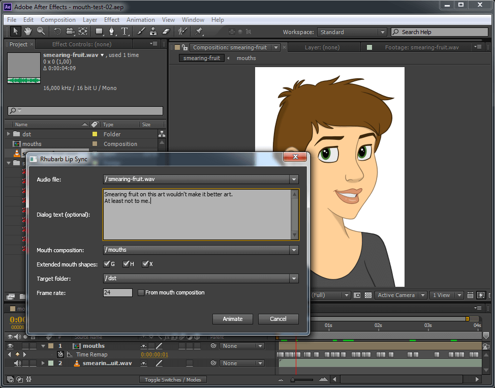
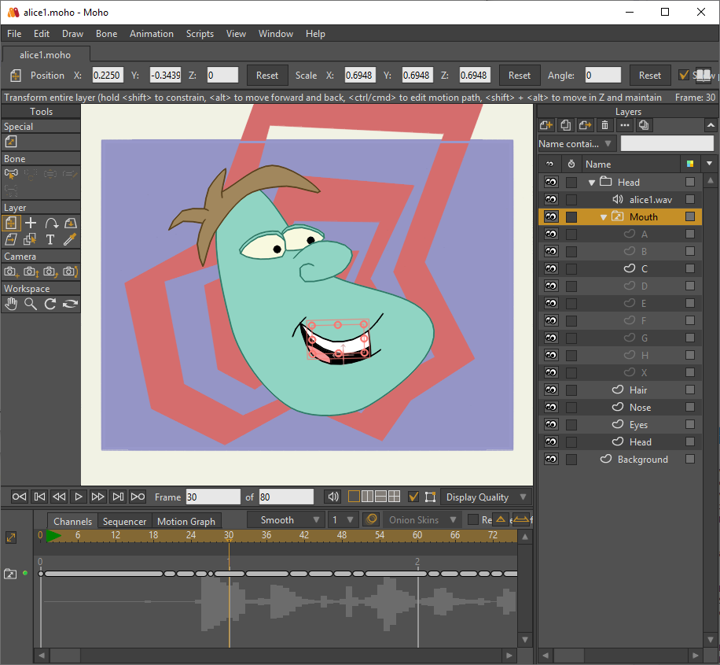
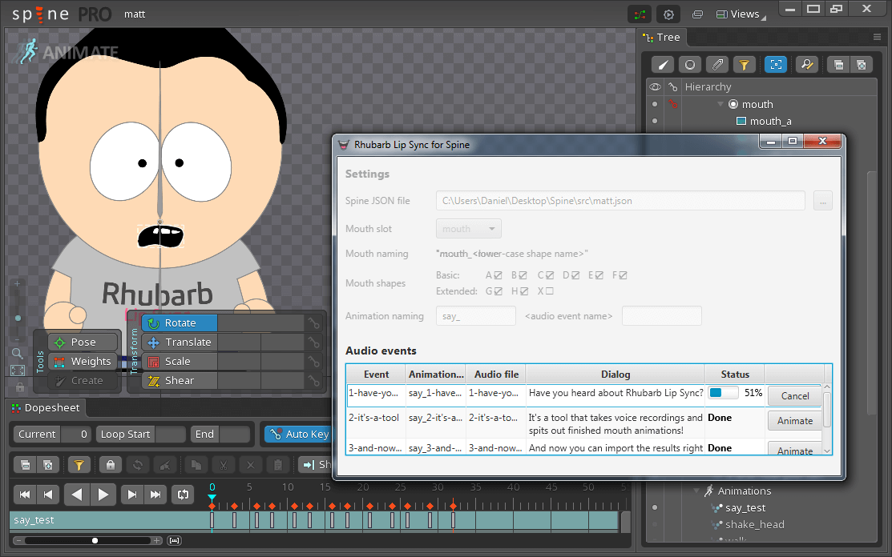
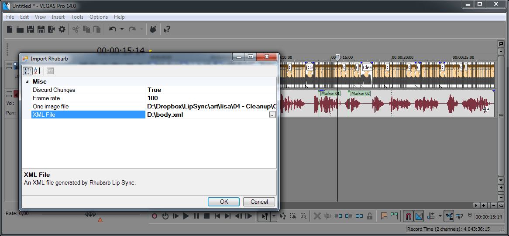

= Rhubarb Lip Sync
:toc:
:icons: font

:A: &#9398;
:B: &#9399;
:C: &#9400;
:D: &#9401;
:E: &#9402;
:F: &#9403;
:G: &#9404;
:H: &#9405;
:X: &#9421;

image:https://img.shields.io/twitter/follow/RhubarbLipSync.svg?style=social&label=Follow["Twitter", link="https://twitter.com/RhubarbLipSync"]
image:https://github.com/DanielSWolf/rhubarb-lip-sync/actions/workflows/ci.yml/badge.svg["Build status", link="https://github.com/DanielSWolf/rhubarb-lip-sync/actions/workflows/ci.yml"]

---

---

Rhubarb Lip Sync allows you to quickly create 2D mouth animation from voice recordings. It analyzes your audio files, recognizes what is being said, then automatically generates lip sync information. You can use it for animating speech in computer games, animated cartoons, or any similar project.

Rhubarb Lip Sync integrates with the following applications:

* *Adobe After Effects* (see <<afterEffects,below>>)
* *Moho* and *OpenToonz* (see <<moho,below>>)
* *Spine* by Esoteric Software (see <<spine,below>>)
* *Vegas Pro* by Magix (see <<vegas,below>>)
* *Visionaire Studio* (see https://www.visionaire-studio.net/forum/thread/mouth-animation-using-rhubarb-lip-sync[external link])

In addition, you can use Rhubarb Lip Sync's command line interface (*CLI*) to generate files in various <<outputFormats,output formats>> (<<tsv,TSV>>/<<xml,XML>>/<<json,JSON>>).

== Demo video

Click the image for a demo video.

https://www.youtube.com/watch?v=zzdPSFJRlEo[image:http://img.youtube.com/vi/zzdPSFJRlEo/0.jpg[]]

== Integrations

[[afterEffects]]
=== Adobe After Effects

You can use Rhubarb Lip Sync to animate dialog right from Adobe After Effects. For more information, <<extras/AdobeAfterEffects/README.adoc#,follow this link>> or see the directory `extras/AdobeAfterEffects`.

[[moho]]
=== Moho and OpenToonz

Rhubarb Lip Sync can create .dat switch data files, which are understood by Moho and OpenToonz. You can set the frame rate using the `--datFrameRate` option; to control the shape names, use the `--datUsePrestonBlair` flag. For more details, see <<options>>.

[[spine]]
=== Spine by Esoteric Software

Rhubarb Lip Sync for Spine is a graphical tool that allows you to import a Spine project, perform automatic lip sync, then re-import the result into Spine. For more information, <<extras/EsotericSoftwareSpine/README.adoc#,follow this link>> or see the directory `extras/EsotericSoftwareSpine` of the download.

[[vegas]]
=== Vegas Pro by Magix

Rhubarb Lip Sync also comes with two plugin scripts for Vegas Pro (previously Sony Vegas).  For more information, <<extras/MagixVegas/README.adoc#,follow this link>> or see the directory `extras/MagixVegas` of the download.

[[mouth-shapes]]
== Mouth shapes

Rhubarb Lip Sync can use between six and nine different mouth positions. The first six mouth shapes ({A}-{F}) are the _basic mouth shapes_ and the absolute minimum you have to draw for your character. These six mouth shapes were invented at the Hanna-Barbera studios for shows such as Scooby-Doo and The Flintstones. Since then, they have evolved into a _de-facto_ standard for 2D animation, and have been widely used by studios like Disney and Warner Bros.

In addition to the six basic mouth shapes, there are three _extended mouth shapes_: {G}, {H}, and {X}. These are optional. You may choose to draw all three of them, pick just one or two, or leave them out entirely.

[cols="1h,2,6"]
|===

| {A} | image:img/lisa-A.png[]
| Closed mouth for the "`P`", "`B`", and "`M`" sounds. This is almost identical to the {X} shape, but there is ever-so-slight pressure between the lips.

| {B} | image:img/lisa-B.png[]
| Slightly open mouth with clenched teeth. This mouth shape is used for most consonants ("`K`", "`S`", "`T`", etc.). It's also used for some vowels such as the "`EE`" sound in b**ee**.

| {C} | image:img/lisa-C.png[]
| Open mouth. This mouth shape is used for vowels like "`EH`" as in m**e**n and "`AE`" as in b**a**t. It's also used for some consonants, depending on context.

This shape is also used as an in-between when animating from {A} or {B} to {D}. So make sure the animations {A}{C}{D} and {B}{C}{D} look smooth!

| {D} | image:img/lisa-D.png[]
| Wide open mouth. This mouth shapes is used for vowels like "`AA`" as in f**a**ther.

| {E} | image:img/lisa-E.png[]
| Slightly rounded mouth. This mouth shape is used for vowels like "`AO`" as in **o**ff and "`ER`" as in b**ir**d.

This shape is also used as an in-between when animating from {C} or {D} to {F}. Make sure the mouth isn't wider open than for {C}. Both {C}{E}{F} and {D}{E}{F} should result in smooth animation.

| {F} | image:img/lisa-F.png[]
| Puckered lips. This mouth shape is used for "`UW`" as in y**ou**, "`OW`" as in sh**ow**, and "`W`" as in **w**ay.

| {G} | image:img/lisa-G.png[]
| Upper teeth touching the lower lip for "`F`" as in **f**or and "`V`" as in **v**ery.

*This extended mouth shape is optional.* If your art style is detailed enough, it greatly improves the overall look of the animation. If you decide not to use it, you can specify so using the <<extendedShapes,`extendedShapes`>> option.

| {H} | image:img/lisa-H.png[]
| This shape is used for long "`L`" sounds, with the tongue raised behind the upper teeth. The mouth should be at least far open as in {C}, but not quite as far as in {D}.

*This extended mouth shape is optional.* Depending on your art style and the angle of the head, the tongue may not be visible at all. In this case, there is no point in drawing this extra shape. If you decide not to use it, you can specify so using the <<extendedShapes,`extendedShapes`>> option.

| {X} | image:img/lisa-X.png[]
| Idle position. This mouth shape is used for pauses in speech. This should be the same mouth drawing you use when your character is walking around without talking. It is almost identical to {A}, but with slightly less pressure between the lips: For {X}, the lips should be closed but relaxed.

*This extended mouth shape is optional.* Whether there should be any visible difference between the rest position {X} and the closed talking mouth {A} depends on your art style and personal taste. If you decide not to use it, you can specify so using the <<extendedShapes,`extendedShapes`>> option.
|===

== How to run Rhubarb Lip Sync

=== General usage ===

Rhubarb Lip Sync is a command-line tool that is currently available for Windows, macOS, and Linux.

* Download the https://github.com/DanielSWolf/rhubarb-lip-sync/releases[latest release] for your operating system and unpack the file anywhere on your computer.
* On the command-line, call `rhubarb`, passing it an audio file as argument and telling it where to create the output file. In its simplest form, this might look like this: `rhubarb -o output.txt my-recording.wav`. There are additional <<options,command-line options>> you can specify in order to get better results.
* Rhubarb Lip Sync will analyze the sound file, animate it, and create an output file containing the animation. If an error occurs, it will instead print an error message to `stderr` and exit with a non-zero exit code.

[[options]]
=== Command-line options ===

==== Basic command-line options ====

The following command-line options are the most common:

[cols="2,5a"]
|===
| Option | Description

| _<input file>_
| The audio file to be analyzed. This must be the last command-line argument. Supported file formats are WAVE (.wav) and Ogg Vorbis (.ogg).

| `-r` _<recognizer>_, `--recognizer` _<recognizer>_
| Specifies how Rhubarb Lip Sync recognizes speech within the recording. Options: `pocketSphinx` (use for English recordings), `phonetic` (use for non-English recordings). For details, see <<recognizers>>.

_Default value: ``pocketSphinx``_

| `-f` _<format>_, `--exportFormat` _<format>_
| The export format. Options: `tsv` (tab-separated values, see <<tsv,details>>), `xml` (see <<xml,details>>), `json` (see <<json,details>>), `dat` (see <<moho>>).

_Default value: ``tsv``_

| `-d` _<path>_, `--dialogFile` _<path>_
| With this option, you can provide Rhubarb Lip Sync with the dialog text to get more reliable results. Specify the path to a plain-text file (in ASCII or UTF-8 format) containing the dialog contained in the audio file. Rhubarb Lip Sync will still perform word recognition internally, but it will prefer words and phrases that occur in the dialog file. This leads to better recognition results and thus more reliable animation.

For instance, let's say you're recording dialog for a computer game. The script says: "`That's all gobbledygook to me.`" But actually, the voice artist ends up saying "`That's _just_ gobbledygook to me,`" deviating from the dialog. If you specify a dialog file with the original line ("`That's all gobbledygook to me`"), this will still allow Rhubarb Lip Sync to produce better results, because it will watch out for the uncommon word "`gobbledygook`". Rhubarb Lip Sync will ignore the dialog file where it audibly differs from the recording, and benefit from it where it matches.

_It is always a good idea to specify the dialog text. This will usually lead to more reliable mouth animation, even if the text is not completely accurate._

[[extendedShapes]]
| `--extendedShapes` _<string>_
| As described in <<mouth-shapes>>, Rhubarb Lip Sync uses six basic mouth shapes and up to three _extended mouth shapes_, which are optional. Use this option to specify which extended mouth shapes should be used. For example, to use only the {G} and {X} extended mouth shapes, specify `GX`; to use only the six basic mouth shapes, specify an empty string: `""`.

_Default value: ``GHX``_

| `-o`, `--output` _<output file>_
| The name of the output file to create. If the file already exists, it will be overwritten. If you don't specify an output file, the result will be written to `stdout`.

| `--version`
| Displays version information and exits.

| `-h`, `--help`
| Displays usage information and exits.

| `--datFrameRate` _number_
| Only valid when using the `dat` export format. Controls the frame rate for the output file.

_Default value: 24_

| `--datUsePrestonBlair`
| Only valid when using the `dat` export format. Uses Preston Blair mouth shapes names instead of the default alphabetical ones. This applies the following mapping:

!===
! Alphabetic name ! Preston Blair name

! A ! MBP
! B ! etc
! C ! E
! D ! AI
! E ! O
! F ! U
! G ! FV
! H ! L
! X ! rest
!===

*Caution:* This mapping is only applied when exporting, _after_ the recording has been animated. To control which mouth shapes to use, use the <<extendedShapes,`extendedShapes`>> option _with the alphabetic names_.

*Tip:* For optimal results, make sure your mouth drawings follow the guidelines in the <<mouth-shapes>> section. This is easier if you stick to the alphabetic names instead of the Preston Blair names. The only situation where you _need_ to use the Preston Blair names is when you're using OpenToonz, because OpenToonz only supports the Preston Blair names.

|===

==== Advanced command-line options ====

The following command-line options can be helpful in special situations, especially when automating Rhubarb Lip Sync.

[cols="2,5"]
|===
| Option | Description

[[quiet]]
| `-q`, `--quiet`
| By default, Rhubarb Lip Sync writes a number of progress messages to `stderr`. If you're using it as part of a batch process, this may clutter your console. If you specify the `--quiet` flag, there won't be any output to `stderr` unless an error occurred.

You can combine this option with the <<consoleLevel,`consoleLevel`>> option to change the minimum event level that is printed to `stderr`.

| `--machineReadable`
a| This option is useful if you want to integrate Rhubarb Lip Sync with another (possibly graphical) application. All status messages to `stderr` will be in structured JSON format, allowing your program to parse them and display a graphical progress bar or something similar. For details, see <<machineReadable,Machine-readable status messages>>.

[[consoleLevel]]
| `--consoleLevel` _<level>_
| Sets the log level for reporting to the console (`stderr`). Options: `trace`, `debug`, `info`, `warning`, `error`, `fatal`.

If <<quiet,`--quiet`>> is also specified, only events with the specified level or higher will be printed. Otherwise, a small number of essential events (startup, progress, etc.) will be printed even if their levels are below the specified value.

_Default value: ``error``_

| `--logFile` _<path>_
| Creates a log file with diagnostic information at the specified path.

|`--logLevel` _<level>_
| Sets the log level for the log file. Only events with the specified level or higher will be logged. Options: `trace`, `debug`, `info`, `warning`, `error`, `fatal`.

_Default value: ``debug``_

| `--threads` _<number>_
| Rhubarb Lip Sync uses multithreading to speed up processing. By default, it creates as many worker threads as there are cores on your CPU, which results in optimal processing speed. You may choose to specify a lower number if you feel that Rhubarb Lip Sync is slowing down other applications. Specifying a higher number is not recommended, as it won't result in any additional speed-up.

Note that for short audio files, Rhubarb Lip Sync may choose to use fewer threads than specified.

_Default value: as many threads as your CPU has cores_
|===

[[recognizers]]
== Recognizers

The first step in processing an audio file is determining what is being said. More specifically, Rhubarb Lip Sync uses speech recognition to figure out what sound is being said at what point in time. You can choose between two recognizers:

=== PocketSphinx

PocketSphinx is an open-source speech recognition library that generally gives good results. This is the default recognizer. The downside is that PocketSphinx only recognizes English dialog. So if your recordings are in a language other than English, this is not a good choice.

=== Phonetic

Rhubarb Lip Sync also comes with a phonetic recognizer. _Phonetic_ means that this recognizer won't try to understand entire (English) words and phrases. Instead, it will recognize individual sounds and syllables. The results are usually less precise than those from the PocketSphinx recognizer. The advantage is that this recognizer is language-independent. Use it if your recordings are not in English.

[[outputFormats]]
== Output formats

The output of Rhubarb Lip Sync is a file that tells you which mouth shape to display at what time within the recording. You can choose between three file formats -- TSV, XML, and JSON. The following paragraphs show you what each of these formats looks like.

[[tsv]]
=== Tab-separated values (`tsv`)

TSV is the simplest and most compact export format supported by Rhubarb Lip Sync. Each line starts with a timestamp (in seconds), followed by a tab, followed by the name of the mouth shape. The following is the output for a recording of a person saying 'Hi.'

[source]
----
0.00	X
0.05	D
0.27	C
0.31	B
0.43	X
0.47	X
----

Here's how to read it:

* At the beginning of the recording (0.00s), the mouth is closed (shape {X}). The very first output will always have the timestamp 0.00s.
* 0.05s into the recording, the mouth opens wide (shape {D}) for the "`HH`" sound, anticipating the "`AY`" sound that will follow.
* The second half of the "`AY`" diphtong (0.31s into the recording) requires clenched teeth (shape {B}). Before that, shape {C} is inserted as an in-between at 0.27s. This allows for a smoother animation from {D} to {B}.
* 0.43s into the recording, the dialog is finished and the mouth closes again (shape {X}).
* The last output line in TSV format is special: Its timestamp is always the very end of the recording (truncated to a multiple of 0.01s) and its value is always a closed mouth (shape {X} or {A}, depending on your <<extendedShapes,`extendedShapes`>> settings).

[[xml]]
=== XML format (`xml`)

XML format is rather verbose. The following is the output for a person saying 'Hi,' the same recording as above.

[source,xml]
----
<?xml version="1.0" encoding="utf-8"?>
<rhubarbResult>
  <metadata>
    <soundFile>C:\Users\Daniel\Desktop\av\hi\hi.wav</soundFile>
    <duration>0.47</duration>
  </metadata>
  <mouthCues>
    <mouthCue start="0.00" end="0.05">X</mouthCue>
    <mouthCue start="0.05" end="0.27">D</mouthCue>
    <mouthCue start="0.27" end="0.31">C</mouthCue>
    <mouthCue start="0.31" end="0.43">B</mouthCue>
    <mouthCue start="0.43" end="0.47">X</mouthCue>
  </mouthCues>
</rhubarbResult>
----

The file starts with a `metadata` block containing the full path of the original recording and its duration (truncated to a multiple of 0.01s). After that, each `mouthCue` element indicates the start and end of a certain mouth shape, as explained for <<tsv,TSV format>>. Note that the end of each mouth cue is identical with the start of the following one. This is a bit redundant, but it means that we don't need a special final element like in TSV format.

[[json]]
=== JSON format (`json`)

JSON format is very similar to <<xml,XML format>>. The choice mainly depends on the programming language you use, which may have built-in support for one format but not the other. The following is the output for a person saying 'Hi,' the same recording as above.

[source,json]
----
{
  "metadata": {
    "soundFile": "C:\\Users\\Daniel\\Desktop\\av\\hi\\hi.wav",
    "duration": 0.47
  },
  "mouthCues": [
    { "start": 0.00, "end": 0.05, "value": "X" },
    { "start": 0.05, "end": 0.27, "value": "D" },
    { "start": 0.27, "end": 0.31, "value": "C" },
    { "start": 0.31, "end": 0.43, "value": "B" },
    { "start": 0.43, "end": 0.47, "value": "X" }
  ]
}
----

There is nothing surprising here; everything said about XML format applies to JSON, too.

[[machineReadable]]
== Machine-readable status messages

Use the `--machineReadable` command-line option to enable machine-readable status messages. In this mode, each line printed to `stderr` will be an object in JSON format. Every object contains the following:

* Property `type`: The type of the event. Currently, one of `"start"` (application start), `"progress"` (numeric progress), `"success"` (successful termination), `"failure"` (unsuccessful termination), and `"log"` (a log message without structured information).
* Event-specific structured data. For instance, a `"progress"` event contains the property `value` with a numeric value between 0.0 and 1.0.
* Property `log`: A log message describing the event, plus severity information. If you aren't interested in the structured data, you can display this as a fallback. For instance, a `"progress"` event with the structured information `"value": 0.69` may contain the following redundant log message: `"Progress: 69%"`.

You can combine this option with the <<consoleLevel,`consoleLevel`>> option. Note, however, that this only affects unstructured events of type `"log"` (not to be confused with the `log` property each event contains).

The following is an example output to `stderr` from a _successful_ run:

[source,json]
----
{ "type": "start", "file": "hi.wav", "log": { "level": "Info", "message": "Application startup. Input file: \"hi.wav\"." } }
{ "type": "progress", "value": 0.00, "log": { "level": "Trace", "message": "Progress: 0%" } }
{ "type": "progress", "value": 0.01, "log": { "level": "Trace", "message": "Progress: 1%" } }
{ "type": "progress", "value": 0.03, "log": { "level": "Trace", "message": "Progress: 3%" } }
{ "type": "progress", "value": 0.06, "log": { "level": "Trace", "message": "Progress: 6%" } }
{ "type": "progress", "value": 0.69, "log": { "level": "Trace", "message": "Progress: 68%" } }
{ "type": "progress", "value": 1.00, "log": { "level": "Trace", "message": "Progress: 100%" } }
# This is the moment that result data is printed to stdout (not stderr)
{ "type": "success", "log": { "level": "Info", "message": "Application terminating normally." } }
----

The following is an example output to `stderr` from a _failed_ run:

[source,json]
----
{ "type": "start", "file": "no-such-file.wav", "log": { "level": "Info", "message": "Application startup. Input file: \"no-such-file.wav\"." } }
{ "type": "failure", "reason": "Error processing file \"no-such-file.wav\".\nCould not open sound file \"no-such-file.wav\".\nNo such file or directory", "log": { "level": "Fatal", "message": "Application terminating with error: Error processing file \"no-such-file.wav\".\nCould not open sound file \"no-such-file.wav\".\nNo such file or directory" } }
----

Note that the output format <<Versioning,adheres to SemVer>>. That means that the JSON output created after a minor upgrade will still be compatible. Note, however, that the following kinds of changes may occur at any time, because I consider them non-breaking:

* Additional types of progress events. Just ignore those events whose types you do not know or use their unstructured `log` property.
* Additional properties in any object. Just ignore properties you aren't interested in.
* Changes in JSON formatting, such as a re-ordering of properties or changes in whitespaces (except for line breaks -- every event will remain on a singe line)
* Fewer or more events of type `"log"` or changes in the wording of log messages

[[versioning]]
== Versioning (SemVer)

Rhubarb Lip Sync uses Semantic Versioning (SemVer) for its command-line interface. For general information on Semantic Versioning, have a look at the http://semver.org/[official SemVer website].

As a rule of thumb, everything you can use through the command-line interface adheres to SemVer. Everything else (i.e., the source code, integrations with third-party software, etc.) does not.

[[building-from-source]]
== Building from source

To use Rhubarb Lip Sync on Windows, macOS, or Linux, you can just download the binary release for your operating system. If you want to modify the code or use Rhubarb on a less-common operating system, this section describes how to build it yourself.

You'll need the following software installed:

* CMake 3.10+
* A C{plus}{plus} compiler that supports C{plus}{plus}17 +
(Rhubarb Lip Sync is regularly built using Visual Studio 2019, Xcode 14, GCC 10, and Clang 12.)
* A current version of Boost
* JDK 8.x (for building Rhubarb for Spine)

Then, follow these steps:

. Create an empty directory `/build` within the Rhubarb repository
. Move to the new `/build` directory
. Configure CMake by running `cmake ..` +
Optionally, pass flags for setting the generator, compiler etc.. For working examples, see `.github\workflows\ci.yml`.
. Build Rhubarb Lip Sync by running `cmake --build . --config Release`

== I'd love to hear from you!

Have you created something great using Rhubarb Lip Sync? -- *https://twitter.com/RhubarbLipSync[Let me know on Twitter]* or *send me an email* at +++&#100;&#119;&#111;&#108;&#102;&#064;&#100;&#097;&#110;&#110;&#097;&#100;&#046;&#100;&#101;+++!

Do you need help? Have you spotted a bug? Do you have a suggestion? -- *https://github.com/DanielSWolf/rhubarb-lip-sync/issues[Create an issue!]*
