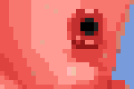

= Rhubarb Lip-Sync
:A: &#9398;
:B: &#9399;
:C: &#9400;
:D: &#9401;
:E: &#9402;
:F: &#9403;
:G: &#9404;
:H: &#9405;
:X: &#9421;

https://github.com/DanielSWolf/rhubarb-lip-sync[Rhubarb Lip-Sync] is a command-line tool that automatically creates 2D mouth animation from voice recordings. You can use it for animating speech in computer games, animated cartoons, or any similar project.

Rhubarb Lip-Sync produces output files in various text formats (TSV/XML/JSON). If you're a programmer, this makes it easy for you to use the output in whatever way you like. If you're not a programmer, there is currently no direct way to import the result into your favorite animation tool. If this is what you need, feel free to https://github.com/DanielSWolf/rhubarb-lip-sync/issues[create an issue] telling me what tool you're using. I might add support for a few popular animation tools in the future.

== Mouth shapes

Rhubarb Lip-Sync uses a set of nine mouth positions. To get good results, you must draw at least the first six mouth shapes ({A}-{F}) for your character. These six mouth shapes were invented at the Hanna-Barbera studios for shows such as Scooby-Doo and The Flintstones. Since then, they have evolved into a _de-facto_ standard for 2D animation, and have been widely used by studios like Disney and Warner Bros.

The additional three mouth shapes ({G}, {H}, and {X}) are optional. You may choose to draw all three of them, pick just one or two, or leave them out entirely.

[cols="1h,2,6"]
|===

| {A} | 
| Closed mouth for the "`P`", "`B`", and "`M`" sounds. This is almost identical to the {X} shape, but there is slight pressure between the lips.

| {B} | 
| Slightly open mouth with clenched teeth. This mouth shape is used for most consonants ("`K`", "`S`", "`T`", etc.). It's also used for some vowels such as the "`EE`" sound in b**ee**.

| {C} | 
| Open mouth. This mouth shape is used for vowels like "`EH`" as in m**e**n, "`AH`" as in s**u**n, and "`EY`" as in s**a**y. It's also used for some consonants, depending on context.

This shape is also used as an in-between when animating from {A} or {B} to {D}. So make sure the animations {A}{C}{D} and {B}{C}{D} look smooth!

| {D} | 
| Wide open mouth. This mouth shapes is used for vowels like "`AA`" as in f**a**ther, "`AE`" as in b**a**t, and "`AY`" as in wh**y**.

| {E} | 
| Slightly rounded mouth. This mouth shape is used for vowels like "`AO`" as in **o**ff, "`UH`" as in sh**ou**ld, and "`OW`" as in sh**o**w.

This shape is also used as an in-between when animating from {C} or {D} to {F}. Make sure the mouth isn't wider open than for {C}. Both {C}{E}{F} and {D}{E}{F} should result in smooth animation.

| {F} | 
| Puckered lips. This mouth shape is used for "`UW`" as in y**ou**, "`OY`" as in b**o**y, and "`W`" as in **w**ay.

| {G} | 
| Biting the lower lip for the "`F`" and "`V`" sounds.

This mouth shape is *optional*. If your art style is detailed enough, it greatly improves the overall look of the animation. If you decide not to use it, you can show the {B} shape instead.

| {H} | 
| This shape should identical to {C}, except for the tongue showing. It is used for the "`L`" sound, so the tongue should touch behind the upper teeth.

This mouth shape is *optional*. Depending on your art style and the angle of the head, the tongue may not be visible at all. In this case, there is no point in drawing this extra shape. If you decide not to use it, you can show the {C} shape instead.

| {X} | image:img/ken-X.png[]
| Idle position. This mouth shape is used for pauses in speech. It is almost identical to {A}, but without the pressure between the lips: For {X}, the lips should be relaxed but closed.

This mouth shape is *optional*. Whether there should be any visible difference between the rest position {X} and the closed talking mouth {A} depends on your art style and personal taste. If you decide not to use this shape, you can safely show the {A} shape instead.
|===

== How to run Rhubarb Lip-Sync

Rhubarb Lip-Sync is a command-line tool that is currently available for Windows and OS X.

* Download the https://github.com/DanielSWolf/rhubarb-lip-sync/releases[latest release] and unzip the file anywhere on your computer.
* Call `rhubarb`, passing it a WAVE file as argument, and redirecting the output to a file. This might look like this: `rhubarb my-recording.wav > output.txt`.
* Rhubarb Lip-Sync will analyze the sound file and print the result to `stdout`. If you've redirected `stdout` to a file like above, you will now have an XML file containing the lip-sync data.

The following is a complete list of available command-line options.

[cols="2,5"]
|===
| Option | Description

| `-f` _<format>_, `--exportFormat` _<format>_
| The export format. Options: `tsv` (tab-separated values, see <<tsv,details>>), `xml` (see <<xml,details>>), `json` (see <<json,details>>). Default value: `tsv`

| `-d` _<path>_, `--dialogFile` _<path>_
| Allows you to explicitly provide the spoken text rather than relying on Rhubarb Lip-Sync's automatic recognition. Specifying the dialog text often results in more accurate lip-sync. The dialog text must be stored in a plain-text file in ASCII or UTF-8 format.

| `--threads` _<number>_
| Rhubarb Lip-Sync uses multithreading to speed up processing. By default, it creates as many worker threads as there are cores on your CPU, which results in optimal processing speed. You may choose to specify a lower number if you feel that Rhubarb Lip-Sync is slowing down other applications. Specifying a higher number is not recommended, as it won't result in any additional speed-up.

Note that for short audio files, Rhubarb Lip-Sync may choose to use fewer threads than specified.

| `--logFile` _<path>_
| Creates a log file with diagnostic information at the specified path.

|`--logLevel` _<level>_
| Sets the log level for the log file. Options: `trace`, `debug`, `info`, `warning`, `error`, `fatal`. Default value: `debug`

| `--version`
| Displays version information and exits.

| `-h`, `--help`
| Displays usage information and exits.

| _<input file>_
| The input file to be analyzed. Must be an sound file in WAVE format.
|===

== How to use the output

The output of Rhubarb Lip-Sync is a file that tells you which mouth shape to display at what time within the recording. You can choose between three file formats -- TSV, XML, and JSON. The following paragraphs show you what each of these formats looks like.

[[tsv]]
=== Tab-separated values (`tsv`)

TSV is the simplest and most compact export format supported by Rhubarb Lip-Sync. Each line starts with a timestamp (in seconds), followed by a tab, followed by the name of the mouth shape. The following is the output for a recording of a person saying 'Hi.'

[source]
----
0.00	X
0.05	D
0.27	C
0.31	B
0.43	X
0.47	X
----

Here's how to read it:

* At the beginning of the recording (0.00s), the mouth is closed (shape {X}). The very first output will always have the timestamp 0.00s.
* 0.05s into the recording, the mouth opens wide (shape {D}) for the "`HH`" sound, anticipating the "`AY`" sound that will follow.
* The second half of the "`AY`" diphtong (0.31s into the recording) requires clenched teeth (shape {B}). Before that, shape {C} is inserted as an in-between at 0.27s. This allows for a smoother animation from {D} to {B}.
* 0.43s into the recording, the dialog is finished and the mouth closes again (shape {X}).
* The last output line in TSV format is special: Its timestamp is always the very end of the recording (truncated to a multiple of 0.01s) and its value is always a closed mouth (shape {X}).

[[xml]]
=== XML format (`xml`)

XML format is rather verbose. The following is the output for a person saying 'Hi,' the same recording as above.

[source,xml]
----
<?xml version="1.0" encoding="utf-8"?>
<rhubarbResult>
  <metadata>
    <soundFile>C:\Users\Daniel\Desktop\av\hi\hi.wav</soundFile>
    <duration>0.47</duration>
  </metadata>
  <mouthCues>
    <mouthCue start="0.00" end="0.05">X</mouthCue>
    <mouthCue start="0.05" end="0.27">D</mouthCue>
    <mouthCue start="0.27" end="0.31">C</mouthCue>
    <mouthCue start="0.31" end="0.43">B</mouthCue>
    <mouthCue start="0.43" end="0.47">X</mouthCue>
  </mouthCues>
</rhubarbResult>
----

The file starts with a `metadata` block containing the full path of the original recording and its duration (truncated to a multiple of 0.01s). After that, each `mouthCue` element indicates the start and end of a certain mouth shape, as explained for <<tsv,TSV format>>. Note that the end of each mouth cue is identical with the start of the following one. This is a bit redundant, but it means that we don't need a special final element like in TSV format.

[[json]]
=== JSON format (`json`)

JSON format is very similar to <<xml,XML format>>. The choice mainly depends on the programming language you use, which may have built-in support for one format but not the other. The following is the output for a person saying 'Hi,' the same recording as above.

[source,json]
----
{
  "metadata": {
    "soundFile": "C:\\Users\\Daniel\\Desktop\\av\\hi\\hi.wav",
    "duration": 0.47
  },
  "mouthCues": [
    { "start": 0.00, "end": 0.05, "value": "X" },
    { "start": 0.05, "end": 0.27, "value": "D" },
    { "start": 0.27, "end": 0.31, "value": "C" },
    { "start": 0.31, "end": 0.43, "value": "B" },
    { "start": 0.43, "end": 0.47, "value": "X" }
  ]
}
----

There is nothing surprising here; everything said about XML format applies to JSON, too.

== Limitations

Rhubarb Lip-Sync has some limitations you should be aware of.

=== English only

Rhubarb Lip-Sync only produces good results when you give it recordings in English. You'll get best results with American English.

=== 2D animation only

Rhubarb Lip-Sync tries to imitate the animation style used in classic 2D animated cartoons. The results look stylized, and that's intentional. If you're working on a realistic 3D game or movie, Rhubarb Lip-Sync may not be the best choice.

== Tell me what you think!

I'd love to hear from you! If you need help or have any suggestions, feel free to https://github.com/DanielSWolf/rhubarb-lip-sync/issues[create an issue].
