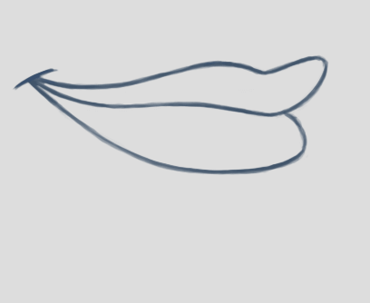
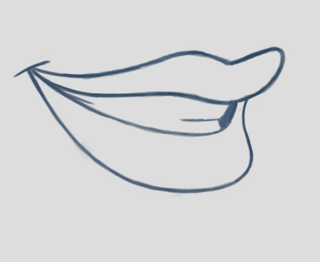
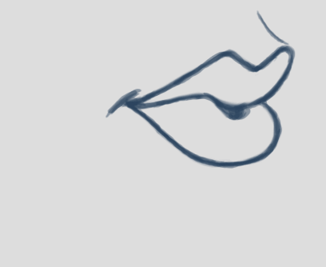
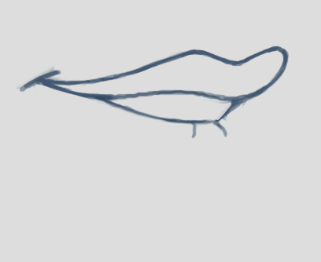
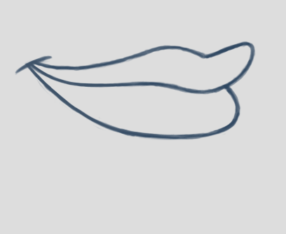

= Rhubarb Lip Sync
:A: &#9398;
:B: &#9399;
:C: &#9400;
:D: &#9401;
:E: &#9402;
:F: &#9403;
:G: &#9404;
:H: &#9405;
:X: &#9421;

image:https://img.shields.io/travis/DanielSWolf/rhubarb-lip-sync/master.svg["Build Status", link="https://travis-ci.org/DanielSWolf/rhubarb-lip-sync"]
image:https://img.shields.io/twitter/follow/RhubarbLipSync.svg?style=social&label=Follow["Twitter", link="https://twitter.com/RhubarbLipSync"]

https://github.com/DanielSWolf/rhubarb-lip-sync[Rhubarb Lip Sync] is a command-line tool that automatically creates 2D mouth animation from voice recordings. You can use it for animating speech in computer games, animated cartoons, or any similar project.

Rhubarb Lip Sync produces output files in various text formats (TSV/XML/JSON). In addition, it comes with integrations for Adobe After Effects and Magix Vegas.

== Demo video

Click the image for a demo video. This was generated using Rhubarb Lip Sync 1.0.0; newer versions create even better animation!

https://www.youtube.com/watch?v=OX_K387EKoI[image:http://img.youtube.com/vi/OX_K387EKoI/0.jpg[]]

[[mouth-shapes]]
== Mouth shapes

Rhubarb Lip Sync can use between six and nine different mouth positions. The first six mouth shapes ({A}-{F}) are the _basic mouth shapes_ and the absolute minimum you have to draw for your character. These six mouth shapes were invented at the Hanna-Barbera studios for shows such as Scooby-Doo and The Flintstones. Since then, they have evolved into a _de-facto_ standard for 2D animation, and have been widely used by studios like Disney and Warner Bros.

In addition to the six basic mouth shapes, there are three _extended mouth shapes_: {G}, {H}, and {X}. These are optional. You may choose to draw all three of them, pick just one or two, or leave them out entirely.

[cols="1h,2,6"]
|===

| {A} | 
| Closed mouth for the "`P`", "`B`", and "`M`" sounds. This is almost identical to the {X} shape, but there is ever-so-slight pressure between the lips.

| {B} | 
| Slightly open mouth with clenched teeth. This mouth shape is used for most consonants ("`K`", "`S`", "`T`", etc.). It's also used for some vowels such as the "`EE`" sound in b**ee**.

| {C} | image:img/lisa-C.png[]
| Open mouth. This mouth shape is used for vowels like "`EH`" as in m**e**n and "`AE`" as in b**a**t. It's also used for some consonants, depending on context.

This shape is also used as an in-between when animating from {A} or {B} to {D}. So make sure the animations {A}{C}{D} and {B}{C}{D} look smooth!

| {D} | image:img/lisa-D.png[]
| Wide open mouth. This mouth shapes is used for vowels like "`AA`" as in f**a**ther.

| {E} | image:img/lisa-E.png[]
| Slightly rounded mouth. This mouth shape is used for vowels like "`AO`" as in **o**ff and "`ER`" as in b**ir**d.

This shape is also used as an in-between when animating from {C} or {D} to {F}. Make sure the mouth isn't wider open than for {C}. Both {C}{E}{F} and {D}{E}{F} should result in smooth animation.

| {F} | 
| Puckered lips. This mouth shape is used for "`UW`" as in y**ou**, "`OW`" as in sh**ow**, and "`W`" as in **w**ay.

| {G} | 
| Upper teeth touching the lower lip for "`F`" as in **f**or and "`V`" as in **v**ery.

*This extended mouth shape is optional.* If your art style is detailed enough, it greatly improves the overall look of the animation. If you decide not to use it, you can specify so using the <<extendedShapes,`extendedShapes`>> option.

| {H} | image:img/lisa-H.png[]
| This shape is used for long "`L`" sounds, with the tongue raised behind the upper teeth. The mouth should be at least far open as in {C}, but not quite as far as in {D}.

*This extended mouth shape is optional.* Depending on your art style and the angle of the head, the tongue may not be visible at all. In this case, there is no point in drawing this extra shape. If you decide not to use it, you can specify so using the <<extendedShapes,`extendedShapes`>> option.

| {X} | 
| Idle position. This mouth shape is used for pauses in speech. This should be the same mouth drawing you use when your character is walking around without talking. It is almost identical to {A}, but with slightly less pressure between the lips: For {X}, the lips should be closed but relaxed.

*This extended mouth shape is optional.* Whether there should be any visible difference between the rest position {X} and the closed talking mouth {A} depends on your art style and personal taste. If you decide not to use it, you can specify so using the <<extendedShapes,`extendedShapes`>> option.
|===

== How to run Rhubarb Lip Sync

=== General usage ===

Rhubarb Lip Sync is a command-line tool that is currently available for Windows and OS X.

* Download the https://github.com/DanielSWolf/rhubarb-lip-sync/releases[latest release] and unzip the file anywhere on your computer.
* Call `rhubarb`, passing it a WAVE file as argument and telling it where to create the output file. In its simplest form, this might look like this: `rhubarb -o output.txt my-recording.wav`. There are additional <<options,command-line options>> you can specify in order to get better results.
* Rhubarb Lip Sync will analyze the sound file, animate it, and create an output file containing the animation. If an error occurs, Rhubarb Lip Sync will instead print an error message to `stderr` and exit with a non-zero exit code.

[[options]]
=== Command-line options ===

The following is a complete list of available command-line options.

[cols="2,5"]
|===
| Option | Description

| `-f` _<format>_, `--exportFormat` _<format>_
| The export format. Options: `tsv` (tab-separated values, see <<tsv,details>>), `xml` (see <<xml,details>>), `json` (see <<json,details>>).

_Default value: ``tsv``_

| `-d` _<path>_, `--dialogFile` _<path>_
| This option is meant for situations where you know the dialog text in advance. Specify a plain-text file (in ASCII or UTF-8 format) containing just the dialog of the audio file. Rhubarb Lip Sync will still perform word recognition internally, but it will prefer words and phrases that occur in the dialog file. This leads to better recognition results and thus more reliable animation.

For instance, let's say you're recording dialog for a computer game. The script says: "`That's all gobbledygook to me.`" But actually, the voice artist ends up saying "`That's _just_ gobbledygook to me,`" slightly changing the dialog. If you specify a dialog file with the original line ("`That's all gobbledygook to me`"), this will still allow Rhubarb Lip Sync to produce better results. Rhubarb Lip Sync will ignore the dialog file where it audibly differs from the recording, and benefit from it where it matches.

_It is always a good idea to specify the dialog text. This will usually lead to more reliable mouth animation, even if the text is not completely accurate._

[[extendedShapes]]
| `--extendedShapes` _<string>_
| As described in <<mouth-shapes>>, Rhubarb Lip Sync uses six basic mouth shapes and up to three _extended mouth shapes_, which are optional. Use this option to specify which extended mouth shapes should be used. For example, to use only the {G} and {X} extended mouth shapes, specify `GX`; to use only the six basic mouth shapes, specify an empty string: `""`.

_Default value: ``GHX``_

| `--threads` _<number>_
| Rhubarb Lip Sync uses multithreading to speed up processing. By default, it creates as many worker threads as there are cores on your CPU, which results in optimal processing speed. You may choose to specify a lower number if you feel that Rhubarb Lip Sync is slowing down other applications. Specifying a higher number is not recommended, as it won't result in any additional speed-up.

Note that for short audio files, Rhubarb Lip Sync may choose to use fewer threads than specified.

_Default value: as many threads as your CPU has cores_

| `-q`, `--quiet`
| By default, Rhubarb Lip Sync writes a number of progress messages to `stderr`. If you're using it as part of a batch process, this may clutter your console. If you specify the `--quiet` flag, there won't be any output to `stderr` unless an error occurred.

| `--logFile` _<path>_
| Creates a log file with diagnostic information at the specified path.

|`--logLevel` _<level>_
| Sets the log level for the log file. Options: `trace`, `debug`, `info`, `warning`, `error`, `fatal`.

_Default value: ``debug``_

| `-o`, `--output` _<output file>_
| The name of the output file to create. If the file already exists, it will be overwritten. If you don't specify an output file, the result will be written to `stdout`.

| `--version`
| Displays version information and exits.

| `-h`, `--help`
| Displays usage information and exits.

| _<input file>_
| The input file to be analyzed. Must be an sound file in WAVE format.
|===

== How to use the output

The output of Rhubarb Lip Sync is a file that tells you which mouth shape to display at what time within the recording. You can choose between three file formats -- TSV, XML, and JSON. The following paragraphs show you what each of these formats looks like.

[[tsv]]
=== Tab-separated values (`tsv`)

TSV is the simplest and most compact export format supported by Rhubarb Lip Sync. Each line starts with a timestamp (in seconds), followed by a tab, followed by the name of the mouth shape. The following is the output for a recording of a person saying 'Hi.'

[source]
----
0.00	X
0.05	D
0.27	C
0.31	B
0.43	X
0.47	X
----

Here's how to read it:

* At the beginning of the recording (0.00s), the mouth is closed (shape {X}). The very first output will always have the timestamp 0.00s.
* 0.05s into the recording, the mouth opens wide (shape {D}) for the "`HH`" sound, anticipating the "`AY`" sound that will follow.
* The second half of the "`AY`" diphtong (0.31s into the recording) requires clenched teeth (shape {B}). Before that, shape {C} is inserted as an in-between at 0.27s. This allows for a smoother animation from {D} to {B}.
* 0.43s into the recording, the dialog is finished and the mouth closes again (shape {X}).
* The last output line in TSV format is special: Its timestamp is always the very end of the recording (truncated to a multiple of 0.01s) and its value is always a closed mouth (shape {X} or {A}, depending on your <<extendedShapes,`extendedShapes`>> settings).

[[xml]]
=== XML format (`xml`)

XML format is rather verbose. The following is the output for a person saying 'Hi,' the same recording as above.

[source,xml]
----
<?xml version="1.0" encoding="utf-8"?>
<rhubarbResult>
  <metadata>
    <soundFile>C:\Users\Daniel\Desktop\av\hi\hi.wav</soundFile>
    <duration>0.47</duration>
  </metadata>
  <mouthCues>
    <mouthCue start="0.00" end="0.05">X</mouthCue>
    <mouthCue start="0.05" end="0.27">D</mouthCue>
    <mouthCue start="0.27" end="0.31">C</mouthCue>
    <mouthCue start="0.31" end="0.43">B</mouthCue>
    <mouthCue start="0.43" end="0.47">X</mouthCue>
  </mouthCues>
</rhubarbResult>
----

The file starts with a `metadata` block containing the full path of the original recording and its duration (truncated to a multiple of 0.01s). After that, each `mouthCue` element indicates the start and end of a certain mouth shape, as explained for <<tsv,TSV format>>. Note that the end of each mouth cue is identical with the start of the following one. This is a bit redundant, but it means that we don't need a special final element like in TSV format.

[[json]]
=== JSON format (`json`)

JSON format is very similar to <<xml,XML format>>. The choice mainly depends on the programming language you use, which may have built-in support for one format but not the other. The following is the output for a person saying 'Hi,' the same recording as above.

[source,json]
----
{
  "metadata": {
    "soundFile": "C:\\Users\\Daniel\\Desktop\\av\\hi\\hi.wav",
    "duration": 0.47
  },
  "mouthCues": [
    { "start": 0.00, "end": 0.05, "value": "X" },
    { "start": 0.05, "end": 0.27, "value": "D" },
    { "start": 0.27, "end": 0.31, "value": "C" },
    { "start": 0.31, "end": 0.43, "value": "B" },
    { "start": 0.43, "end": 0.47, "value": "X" }
  ]
}
----

There is nothing surprising here; everything said about XML format applies to JSON, too.

== Limitations

Rhubarb Lip Sync has some limitations you should be aware of.

=== English only

Rhubarb Lip Sync only produces good results when you give it recordings in English. You'll get best results with American English.

=== 2D animation only

Rhubarb Lip Sync tries to imitate the animation style used in classic 2D animated cartoons. The results look stylized, and that's intentional. If you're working on a realistic 3D game or movie, Rhubarb Lip Sync may not be the best choice.

== Tell me what you think!

I'd love to hear from you!

* Have you created something great using Rhubarb Lip Sync? *https://twitter.com/RhubarbLipSync[Let me know on Twitter!]*
* Do you need help? Have you spotted a bug? Do you have a suggestion? *https://github.com/DanielSWolf/rhubarb-lip-sync/issues[Create an issue!]*
