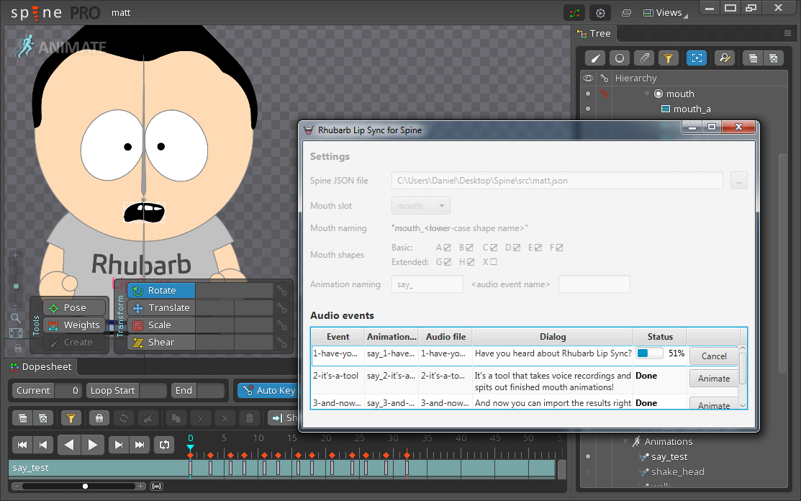

= Rhubarb Lip Sync for Spine

Rhubarb Lip Sync for Spine is a graphical tool that allows you to import a Spine project, perform automatic lip sync, then re-import the result into Spine.

== Installation

https://github.com/DanielSWolf/rhubarb-lip-sync/releases[Download Rhubarb Lip Sync] for your platform, then extract the archive file in a directory on your computer. You’ll find Rhubarb Lip Sync for Spine in the directory `extras/EsotericSoftwareSpine`.

To create lip sync animation, you’ll need Spine 3.7 or better.

== Preparing your Spine project

You can add lip-sync’ed dialog to any Spine skeleton. First, make sure it has a dedicated slot for its mouth. I’m naming the slot `mouth`, but you can choose any name you like.

Next, add image attachments to the mouth slot, one attachment per mouth shape. For details about the expected mouth shapes, https://github.com/DanielSWolf/rhubarb-lip-sync#user-content-mouth-shapes[refer to the Rhubarb Lip Sync documentation]. You’ll need at least the six basic mouth shapes A-F. If you add any of the extended mouth shapes, Rhubarb will automatically use them to create better-looking animation. I’m naming the attachments `mouth_a`, `mouth_b`, `mouth_c`, etc. You can choose any naming scheme you like and Rhubarb will detect it, as long as it’s consistent (including upper and lower case). For instance, `A-Lips`, `B-Lips`, `C-Lips`, … is fine; `mouth a`, `mouth B`, `Mouth-C`, … isn’t.

Finally, you need to add some audio events, that is, events with associated audio path. These audio events will be the basis for animation.

_Optionally_, you can enter the dialog text into each event’s string property. If you do, this will help Rhubarb to create more reliable animation. But don’t worry: If you don’t enter the dialog text or if you already use the string property for something else, the results will normally still be good. For more information, see the https://github.com/DanielSWolf/rhubarb-lip-sync#user-content-options[documentation on the `--dialogFile` option].

== Exporting a JSON file

Export the skeleton(s) by selecting _Spine_ | _Export…_.

Choose JSON format. Make sure the output folder is the same folder that contains your `.spine` file, or Rhubarb won’t be able to locate your audio files. Also, make sure to check the _Nonessential data_ checkbox. Despite the name, Rhubarb needs this information. Finally, click _Export_. This will create a file with the same name as your skeleton and the extension `.json`.

== Performing lip sync

Open Rhubarb Lip Sync for Spine by double-clicking `rhubarb-for-spine.jar` in the Windows Explorer (Windows) or Finder (OS X). Specify the input settings as follows:

* *Spine JSON file:* This is the file you just exported. The most convenient way to fill this field is to drag-and-drop the JSON file anywhere onto the application window. Alternatively, you can use the `…' button or manually enter the file path.
* *Mouth slot:* This tells Rhubarb which of your Spine slots represents the mouth. The dropdown shows all the slots on your skeleton. If your mouth slot contains the word `mouth', Rhubarb will automatically select it for you. Otherwise, select it manually.
* *Mouth naming:* Rhubarb will automatically detect the naming scheme you used for your mouth attachments and display it here. This is for your information only.
* *Mouth shapes:* This group of checkboxes tells you which mouth shapes were found. At least the basic mouth shapes A-F need to be present. This, too, is informational only.
* *Animation naming:* When animating, Rhubarb will create new Spine animations based on your existing audio events. The two text fields allow you to fine-tune the animation naming.

At the bottom of the window, there is a grid with one row per audio event. To animate any audio event, click the corresponding _Animate_ button. Animation jobs are queued, so the next animation job starts once the previous one has finished.

Each time an animation job finishes, the JSON file is updated with the new animation. When you are done animating, you can close Rhubarb Lip Sync for Spine.

== Importing the animated results

Rhubarb Lip Sync for Spine has only changed the exported `.json` file, not your original `.spine` project file. To do that, switch back to Spine.

Delete your skeleton by selecting it in the hierarchy tree and clicking the _Delete_ button. If you don’t, Spine will complain in the next step that a skeleton with this name already exists.

Select _Spine_ | _Import Data…_. Make sure the JSON file path is correct. Also make sure the checkbox _New project_ is *not checked*, or else Spine will start confusing paths. Click OK to re-import the skeleton from the JSON file.

If everything went well, you will now have a number of new, lip-sync’ed animations on your skeleton!
